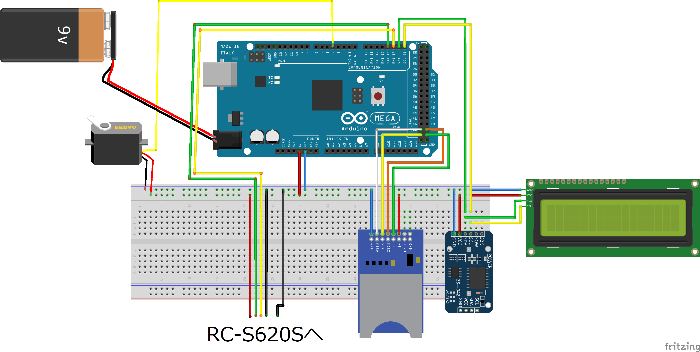

# このリポジトリについて
制作したカードリーダーによるカードキーシステムのコード群や説明を載せています。

# 使い方
## 電源ONから使用まで
Arduino Mega2560 の電源を入れます。
SDカードリーダーモジュールとRC-S620Sの初期化が行われます。
```
SD init OK
RC-S620S init ok
```
と表示されたら正常です。
* <code>SD Faild!</code> と表示される
    * SDカードがちゃんと刺さっているか、SDカードリーダーモジュールが基板上でちゃんと接続出来ているか確かめてください。
* <code>SD init OK</code> から動かない
    * RC-S620S のフラットケーブルや基板上の接続を確かめてください。

その後
```
2021/06/21 21:36:14
Wait FeliCa
```
のように時刻と <code>Wait FeliCa</code> の文字列が表示されます。あとは任意のFeliCaカードで鍵の開け閉めを行うことができるはずです。
* 登録されたFeliCaカードの場合
    * 入退室記録に合わせて
    ```
    2021/06/21 21:36:14
    Enter
    imaimai
    ```

    ```
    2021/06/21 21:36:14
    Leave
    imaimai
    ```
    と表示されます。
* 登録されていないFeliCaカードの場合
    ```
    2021/06/21 21:36:14
    Touch
    Unknown user
    ```
    と表示されます。IDと名前の登録を行ってください。

## FeliCaカードの登録方法
* Arduino Mega 2560に電源を入れ、cardkey.inoを開いてください。
* シリアルモニタを開いてください。
* 登録したいFeliCaカードををRC-S620Sにかざすと、シリアルモニタで
    ```
    Unknown FeliCa: IDm = 任意のID
    ```
    と表示されます。これがそのFeliCaカードのIDです。
* cardkey.inoを編集します。
    * <code>const char IDm任意の番号(001など)[] PROGMEM = "YourID";</code>

        の<code>YourID</code>の部分を先ほど表示されたIDに変えてください。
    * <code>const char* const IDms[] PROGMEM = { };</code>
        
        の{ }内に↑で設定した<code>IDm任意の番号</code>を追加してください
    * <code>const char name任意の番号(001など)[] PROGMEM = "YourNAME";</code>

        の<code>YourNAME</code>の部分を先ほど任意の名前に変えてください。

        (例)"iamimai", "kosen taro" など
    * <code>const char* const names[] PROGMEM = { };</code>
        
        の{ }内に↑で設定した<code>name任意の番号</code>を追加してください

* 例　高専太郎さんのFeliCaカードのIDが<code>0123456789ABCDEF</code>で高専花子さんのFeliCaカードのIDが<code>FEDCBA9876543210</code>だった場合
    ```
    const char IDm001[] PROGMEM = "0123456789ABCDEF";
    const char IDm002[] PROGMEM = "FEDCBA9876543210";
    const char* const IDms[] PROGMEM = { IDm001, IDm002 };

    const char name001[] PROGMEM = "kosen taro";
    const char name002[] PROGMEM = "kosen hanako";
    const char* const names[] PROGMEM = { name001, name002 };
    ```

## 時刻の設定方法
cardkey.inoをコンパイルすると、そのコンパイルした時刻に設定されます。


## その他注意点

* RTCはボタン電池の残量がある限り、Arduino Mega 2560の電源が入っていなくても自動でクロックします。時刻がずれる心配はありません。
* 挿入されたmicroSDカードに日にちごとに入退室記録が記録されます。
* サーボモータは動かすごとにdetatchされるので、鍵で開けることも可能です。
* 現在の入退室状況（入室・退室）も記録されているため、その人が退室した状態・入室した状態でArudino Mega 2560をリセットしても、入退室状況がリセットされることはありません。
    * 万が一入退室状況が違う場合は、ドアを開けた状態で入退室したりして調節してください。
* microSDカードを抜いてしまった場合はArduino Mega 2560 の電源を入れなおしてください。正常に記録されない可能性がります。
* もしフラットケーブルがFeliCaカードリーダ/ライターから抜けてしまった場合、コネクタ口に青いビラビラが表になるように合わせて、爪で青いビラビラを押し込んでください。そうすることで再度挿し込むことができます。


# 使用部品
[ELEGOO Arduino MEGA2560](https://www.amazon.co.jp/dp/B06Y4KZV1J/ref=cm_sw_r_tw_dp_XBV1WFBJGND9N8MNKZDT?_encoding=UTF8&psc=1)

[HiLetgo 5V 2004 20X4 キャラクタ LCDディスプレイ](https://www.amazon.co.jp/gp/product/B010SHNMW2/ref=ppx_yo_dt_b_asin_title_o01_s00?ie=UTF8&psc=1)

[WINGONEER 小型DS3231 AT24C32 RTC](https://www.amazon.co.jp/gp/product/B01H5NAFUY/ref=ppx_yo_dt_b_asin_title_o01_s00?ie=UTF8&psc=1)

[HiLetgo 3個セット Micro SD TFカードメモリシールドモジュール](https://www.amazon.co.jp/gp/product/B010GXAFFU/ref=ppx_yo_dt_b_asin_title_o01_s00?ie=UTF8&psc=1)

[FeliCa リーダー・ライター RC-S620S](https://ssci.to/353)

[FeliCa RC-S620S/RC-S730 ピッチ変換基板のセット(フラットケーブル付き)](https://ssci.to/1029)

## その他汎用部品
9Vバッテリー&スナップ

サーボモータ（SG5010）

DS3231用のボタン電池（LIR2032）

# 回路図


## Arduino Mega 2560 とセンサの接続
| Arduino Mega 2560 | ピッチ変換基板 |
|:-----------------:|:-------------:|
| 5V                | VDD           |
| GND               | GND           |
| TX1(18)           | RXD           |
| RX1(19)           | TXD           |

| Arduino Mega 2560 | LCD           |
|:-----------------:|:-------------:|
| 5V                | VDD           |
| GND               | GND           |
| SDA(20)           | SDA           |
| SC+(21)           | SCL           |

| Arduino Mega 2560 | RTC DS3231    |
|:-----------------:|:-------------:|
| 5V                | VCC           |
| GND               | GND           |
| TX1(18)           | SDA           |
| RX1(19)           | SCL           |

| Arduino Mega 2560 | SDカードリーダーモジュール |
|:-----------------:|:-------------:|
| 5V                | +5            |
| GND               | GND           |
| 50                | MISO          |
| 51                | MOSI          |
| 52                | SCK           |
| 53                | CS            |

# 諸プログラムについて
## RCS620S.h / RCS620S.cpp
ソニーが開発したRC-S620Sを制御するライブラリです。

http://blog.felicalauncher.com/sdk_for_air/?page_id=2699

上記URLからダウンロードできるソースコードを、Arduino Mega 2560 で使用できるようにするため、一部変更を加えています。

## cardkey.ino
このシステムを動かしているプログラムです。

# 改良点
- プログラムを変えることでしかカードの登録ができない
    - 名前を登録しなくてよいなら自動でできるが、入退室記録の際に名前はあった方がよい
- サーボモータがなぜか動いている＆電池の消費が激しい
    - 本来なら電流がたりない気がするが動いている
    - 改良するなら[こちら](https://www.petitmonte.com/robot/mg996r.html)を参照
- LEDや音を付けてもよいかもしれない
    - 電池の消耗と比べると…
- 充電式の乾電池にするとよさそう

# 執筆者について
- [Twitter](https://twitter.com/imaimai17468)

- mail
    - tosiki_801_life@outlook.jp (PC)
    - tosiki_801_life@icloud.com (携帯)